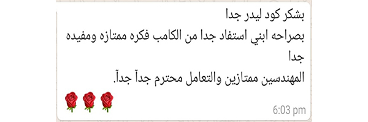
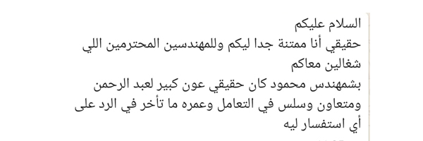

<!doctype html>
<html lang="en">

<head>
    <!-- Required meta tags -->
    <meta charset="utf-8">
    <meta name="viewport" content="width=device-width, initial-scale=1, shrink-to-fit=no">

    <!-- Font Awesome StyleSheet CSS -->
    <!--    <link href="css/fontawesome.min.css" rel="stylesheet">-->

    <link rel="stylesheet" href="https://maxcdn.bootstrapcdn.com/font-awesome/4.5.0/css/font-awesome.min.css">

    <!-- Bootstrap CSS -->
    <link rel="stylesheet" href="https://cdn.jsdelivr.net/npm/bootstrap@4.0.0/dist/css/bootstrap.min.css" integrity="sha384-Gn5384xqQ1aoWXA+058RXPxPg6fy4IWvTNh0E263XmFcJlSAwiGgFAW/dAiS6JXm" crossorigin="anonymous">

    <link rel="stylesheet" href="css/main.css">
    <link rel="stylesheet" href="css/style.css">
    <link rel="stylesheet" href="css/responsive.css">

    <title>Codeleader-Home</title>
</head>

<body>

    <a class="whatsapp-button" target="_blank" href="https://api.whatsapp.com/send?phone=+201063628822&text=">

        <i class="fa fa-whatsapp my-float"></i>

    </a>

    
 <i class="fa fa-arrow-up" aria-hidden="true"></i> 

    <!--   navbar  -->

    <header>
        <nav class="navbar navbar-expand-lg navbar-light">
            

                
                <button class="navbar-toggler" type="button" data-toggle="collapse" data-target="#navbarTogglerDemo03" aria-controls="navbarTogglerDemo03" aria-expanded="false" aria-label="Toggle navigation">
                    
                </button>

                

                    <ul class="navbar-nav mr-auto mt-2 mt-lg-0">
                        <li class="click nav-item active1">
                            <a class="nav-link" href="index.html">Home</a>
                        </li>
                        <li class="nav-item">
                            <a class="nav-link" href="index.html#about_us">About Us</a>
                        </li>
                        <li class="nav-item">
                            <a class="nav-link " href="gallery.html">Studets's Work</a>
                        </li>
                        <li class="nav-item">
                            <a class="nav-link " href="courses.html">Courses</a>
                        </li>
                        <li class="nav-item">
                            <a class="nav-link " href="events.html">Free sessions</a>
                        </li>
                        <li class="nav-item">
                            <a class="nav-link " href="staff.html">Senior Instructors</a>
                        </li>
                        <li class="nav-item">
                            <a class="nav-link " href="stories.html">Success Stories</a>
                        </li>
                    </ul>
                

            

        </nav>

    </header>

    <!--    slider section -->

    <section class="slider">
        
        

            

                
welcome to our Academy

                
Programming Training and Skills Development

                
Join Us

            

        

    </section>

    <!--About Us section-->

    <section class="about section" id="about_us">

        

            

                

                    <!--Heading Wrap Start-->
                    

                        <h4> Why choose us</h4>
                    

                    <!--Heading Wrap End-->
                    
 An administrative support team is available throughout the course to follow up all students.  

                    
 We are always interested in providing complete content on scientific principles ,

                        interested in encouraging students to learn and motivating them in different ways to enjoy the course ,
                        care about continuous practical training during the course.  

                    
 Our instructors are engineers, specialized in their respective fields ,
                        and certificate is issued to each student after completing the course.

                    <ul class="categries-list">

                        <li>strong content</li>

                        <li>Administrative support team</li>

                        <li>encourage students</li>

                        <li>continuous training</li>

                        <li>Excellent team</li>

                        <li>Accredited certification</li>

                    </ul>
                

            

            

                <iframe height="400" width="100%" src="https://www.youtube.com/embed/AxAKLIhl6rU" title="YouTube video player" frameborder="0" allow="accelerometer; autoplay; clipboard-write; encrypted-media; gyroscope; picture-in-picture" allowfullscreen></iframe>

            

        

    </section>
    <!--About Us End-->

    <!-- Video Wrap Start-->
    <section class="video-wrap">

        <h1>Start Learning New Things</h1>
        <h5>We are the best Programming courses professionals</h5>
        <a href="courses.html" class="play-track link"><i class="fa fa-play-circle-o"></i>view courses</a>

    </section>
    <!-- Video Wrap End-->

    <!--Testimonial Slider Wrap Start-->

    <section class="section testimonial ">
        

            <!--Heading 1 Start-->
            

                <h4>former student  testimonial</h4>
                
We are always happy with the opinion of our valued customers, which always motivates us to move forward
                

            

            

                

                    

                        

                            

                                

                                    <figure>
                                        
                                    </figure>

                                

                            

                            

                                

                                    <figure>
                                        
                                    </figure>

                                

                            

                        

                    

                    

                        

                            

                                

                                    <figure>
                                        
                                    </figure>

                                

                            

                            

                                

                                    <figure>
                                        
                                    </figure>

                                

                            

                        

                    

                    

                        

                            

                                

                                    <figure>
                                        
                                    </figure>

                                

                            

                            

                                

                                    <figure>
                                        
                                    </figure>

                                

                            

                        

                    

                    

                        

                            

                                

                                    <figure>
                                        
                                    </figure>

                                

                            

                            

                                

                                    <figure>
                                        
                                    </figure>

                                

                            

                        

                    

                

            

        

    </section>

    <!--Testimonial Slider Wrap End-->

    <!--Footer Wrap Start-->

    <footer class="iq_footer_bg">
        

            

                <!--Widget Archive Start-->
                

                    

                        <!--Widget Title Start-->
                        <h5 class="widget-title">Our Services</h5>
                        <!--Widget Title End-->

                        <!--Social Media Start-->

                        <ul>
                            <li class="active"><a href="index.html">Home</a></li>

                            <li><a href="courses.html">Courses</a></li>

                            <li><a href="gallery.html">Students's Work</a></li>
                            <li><a href="events.html">Free Sessions</a></li>

                        </ul>
                        <!--Social Media End-->
                    

                

                <!--Widget Archive End-->

                <!--Widget  End-->
                

                    <h5 class="widget-title border-none ">Our Connected</h5>

                    <ul>
                        <li style="font-size: 14px;font-family: sans-serif;">Call us : +201063628822</li> 
                        <li style="font-size: 14px;font-family: sans-serif;">Email : codeleader2020@gmail.com</li> 
                        <li style="font-size: 14px;font-family: sans-serif;">Address :

                            Company 306 A , Trivium Square Building, Third Sector, North Ninety, Fifth Settlement, New Cairo.

                        </li>

                    </ul>

                     

                    <!--Widget Title Start-->
                    <ul class="iq_footer_social">
                        <li>
                            <a href="https://www.facebook.com/CodeLeader2020" target="_blank"><i class="fa fa-facebook"></i></a>
                        </li>
                        <li>
                            <a href="https://instagram.com/codeLeader_eg" target="_blank"><i class="fa fa-instagram"></i></a>
                        </li>
                        <li>
                            <a href="https://www.youtube.com/channel/UChs7D6Z4YeUA6VQk8vWB_dg" target="_blank"><i class="fa fa-youtube"></i></a>
                        </li>
                        <li>
                            <a href="https://www.behance.net/codeleader" target="_blank"><i class="fa fa-behance"></i></a>
                        </li>
                    </ul>

                

                <!--Widget  Start-->
                

                    

                        <!--Widget Title Start-->
                        <h5 class="widget-title">About US</h5>
                        <!--Widget Title End-->
                        
Online programming academy. Learn programming for children form 5-18 years using STEAM.

                             We help students to set the right path in the world of programming to help them Keeping up with technology.
                        

                    

                

            

        

    </footer>

    <!--Footer Wrap End-->
    <!--Copy Right Start-->
    

        <h5><a class="maincolor" target="_blank" href="#">CodeLeader</a></h5>
    

    <!--Copy Right End-->

    

    <!-- Optional JavaScript -->
    <!-- jQuery first, then Popper.js, then Bootstrap JS -->
    
    
    

</body>

</html>
